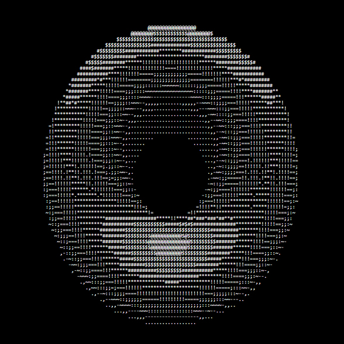

### ASCII Donut Animation
In this tutorial, I am gonna showing to you how to code a ascii spinning donut animation with javascript. we create a project that we use too many math calculation in it❗️

# Screenshot
Here we have project screenshot :

